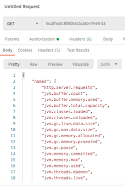

# SumUpChallenge


This is a Java HTTP job processing app build with Spring. The purpose of this application is to sort  
the tasks contained in a job to create a proper execution order. Additional information about
the coding challenge can be found in this [PDF](readme-resources/SumUp_coding_challenge_Generic.pdf).

## Prerequisites

1. Java 11
2. Docker (optional)

## Interact with the app

In order to send a request to the app it has to be started either by running `bootRun` from the gradle menu or my running
the `CodingChallengeApplication` class.

Shortly the app will start, and it will be able to receive requests on port `8080` to it. Two endpoints are available 
`/sort-task/json` and `/sort-task/bash`. The former one returns the sorted task in a json format while the latter
returns a bash script representation which you could run straight away:
 ```bash
curl --location --request POST 'localhost:8080/sort-task/bash' \
--header 'Content-Type: application/json' \
--data-raw '{"tasks":[{"name":"task-1","command":"touch /tmp/file1"},{"name":"task-2","command":"cat /tmp/file1","requires":["task-3"]},{"name":"task-3","command":"echo '\''Hello World!'\'' > /tmp/file1","requires":["task-1"]},{"name":"task-4","command":"rm /tmp/file1","requires":["task-2","task-3"]}]}' \
| bash
 ```

This project contains a `Dockerfile` so it could be started as a container. In order to do that first 
an image has to be built:
```bash
docker build -t coding-challenge .
```
After the command finishes the container can be started with:
```bash
docker run -p 8080:8080 coding-challenge
```
It will be available for requests again on port `8080`.

## Input Validation

The application has input validation. Every task must have a `name` and a `command`. If one of them is not present
the application will return a `Bad Request` error code with some feedback. Additionally, it is not allowed for a task
to require another task which is not present in the input list. To this the app will again return `Bad Request` with 
some feedback as a message. 

## Metrics

The Java app also exposes metrics. When the application is running you can send a `GET` request to the 
`/actuator/metrics` endpoint to see all the available metrics. You can then send another `GET` to a metric
of choice:
```bash
curl --location --request GET 'localhost:8080/actuator/metrics'
```



## CI/CD pipeline

This project uses [github actions](https://github.com/learn/devops?utm_source=google&utm_medium=ppc&utm_campaign=devops_campaign_q1_WileyWebcast_EMEA_ggl&utm_content=version1&gclid=CjwKCAjw-5v7BRAmEiwAJ3DpuH-4FrcN5q9f8k675E9XSJyu3Iwn8OPo9tS8irDEn-7QqdFOMzYE2BoCvOYQAvD_BwE#actionsvideo)
as a CI/CD pipeline. Currently, a `./gradlew build` command is ran on every push. The `build` executes all the unit and 
acceptance tests.

## Kubernetes

The application is K8s deployable. In addition to the `k8s-deployment.yaml` with which you can create a
deployment it has an HPA manifest file which defines a minimum and maximum pods and a CPU Utilization metric on which
it autoscales (assuming the metrics-server of the cluster is enabled). Additionally, it has a `LoadBalancer`
service manifest file with which you can expose the deployment. You can send requests to the `LoadBalancer` which will in
turn forward them to the different pods. The setup is tested with [minikube](https://kubernetes.io/docs/setup/learning-environment/minikube/).

